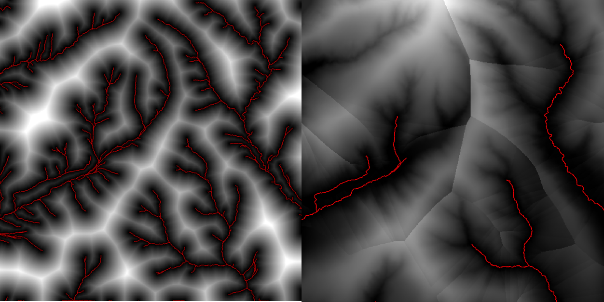
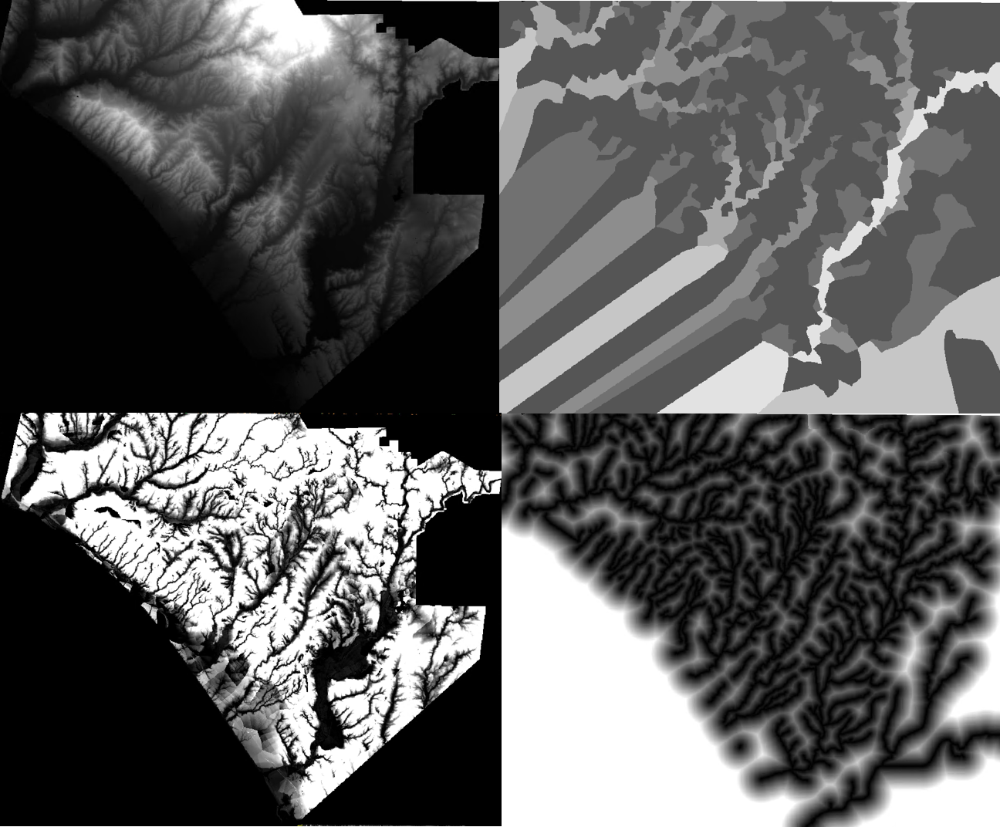

# Riparian Hydrology 

Library to generate basic hydrology outputs for areas around stream flowlines. 

Currently, outputs for each point in input DEM point cloud:
- Lateral distance to nearest flowline
- Vertical distance to nearest flowline
- Strahler order of nearest flowline

## Input / Output Formats:

Takes flowline input information in .csv format compatible with LSDTopoTools library. Takes DEM input as .tif image. Outputs data in .tif format.

Currently, limited ability to reproject input data if flowline and DEM information have different projections.

Probably going to update soon to allow other input/output formats (especially .pcd and .las for DEM and output image, .tif for output, and .pcd, .las, or .shp formats for flowlines).

Currently, requires that .csv files be formatted essentially as point clouds with dense point sampling along flowlines. Lower priority goal is to allow distance calculations with flowlines as line segments (.shp line geometries).

## Usage:

From within the directory, call:

```
build/flow_dist_extraction  data/flowlines.csv  data/dem.tif  data/output_file.csv  1
```

Arguments: 

data/flowines.csv - the file name of the input flowlines information
data/dem.tif - the file name of the input DEM image
data/flowines.csv - the file name of the output .csv file containing all generated point data
1 - Strahler Order Threshold - positive integer value. Flowlines below this threshold will not be considered for this analysis. 

## Example Images:



Above, a small-scale set of output images for a tiny region on Pendleton Marine Corps Base. Left, the horizontal distance to the nearest 1st-order flowline. Right, the vertical distance to the nearest 3rd-order flowline.



Below, a much larger-scale set of outputs showing the entirety of Pendleton Marine Corps Corps Base, with the Santa Margarita River at bottom. Top left: DEM (0 to 880 m); Top right: Strahler Order of nearest flowline (1 to 8); Bottom Left: vertical distance to nearest flowline of order at least 3 (thresholded 0-30 m); Bottom Right: horizontal distance to nearest flowline of order at least 3 (thresholded 0-300 m).
